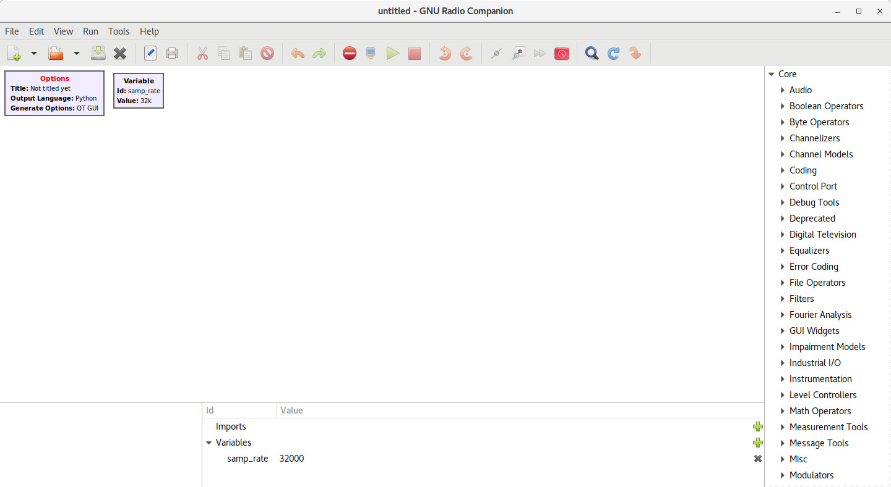
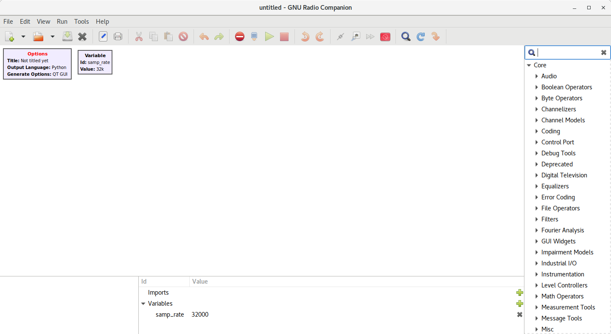
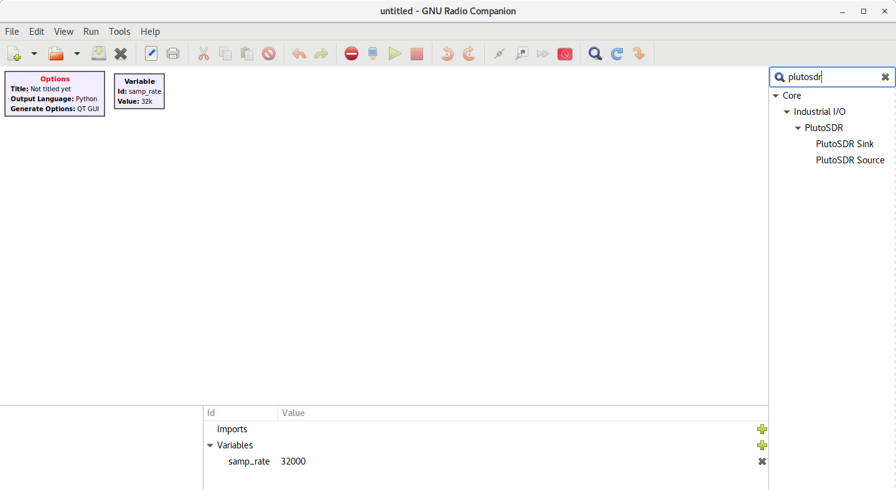

# Getting started with GNURadio and PlutoSDR on Ubuntu 18.04

## Install GNURadio and PlutoSDR drivers

### Add GNURadio PPA, update apt sources, and install GNURadio

```bash
sudo add-apt-repository ppa:gnuradio/gnuradio-releases
sudo apt update
sudo apt install gnu-radio
```

### Install build dependencies for PlutoSDR drivers

```bash
sudo apt install -y gnuradio-dev libxml2 libxml2-dev bison flex cmake git libaio-dev libboost-all-dev swig
```

### Build and install libiio with Python bindings

```bash
git clone https://github.com/analogdevicesinc/libiio.git
cd libiio
mkdir build && cd build
# -DPYTHON_BINDINGS=ON enables building Python bindings for libiio
cmake -DPYTHON_BINDINGS=ON -DCMAKE_INSTALL_PREFIX:PATH=/usr ..
make -j`nproc`
sudo make install
cd ../..
```

### Build and install libiio drivers for AD9371

```bash
git clone https://github.com/analogdevicesinc/libad9361-iio.git
cd libad9361-iio
mkdir build && cd build
cmake -DCMAKE_INSTALL_PREFIX:PATH=/usr ..
make -j`nproc`
sudo make install
cd ../..
```

### Build and install libiio and PlutoSDR blocks for GNURadio 3.8.x

```bash
git clone https://github.com/analogdevicesinc/gr-iio.git
cd gr-iio
git checkout upgrade-3.8
mkdir build && cd build
cmake -DCMAKE_INSTALL_PREFIX:PATH=/usr ..
make -j`nproc`
sudo make install
cd ../..
sudo ldconfig
```

### Add libiio and PlutoSDR blocks to GNURadio block path (if you used a prefix other than `/usr`)

```bash
mkdir $HOME/.gnuradio
cat << EOF > $HOME/.gnuradio/config.conf
[grc]
local_blocks_path=/usr/share/gr-iio/grc/blocks/
EOF
```

## Test it out

### Fire up GNURadio Companion

```bash
gnuradio-companion
```

You should see a window like this:



Now click the search icon in the top bar to search the list of blocks:



In the search box, type "plutosdr", and you should see the PlutoSDR blocks under the "Industrial IIO" category:

