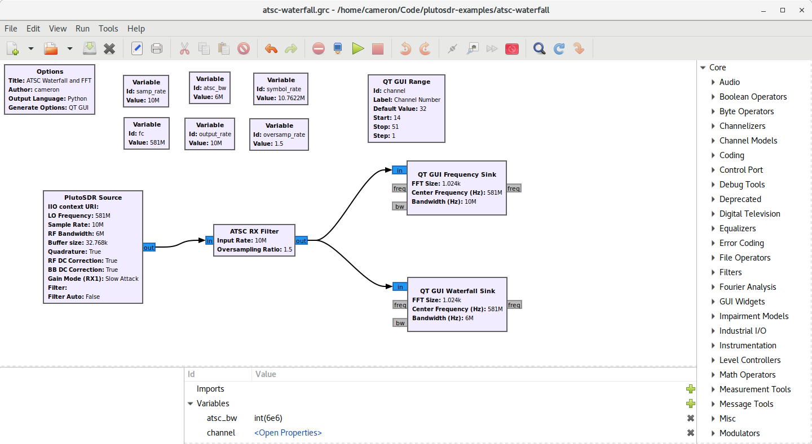
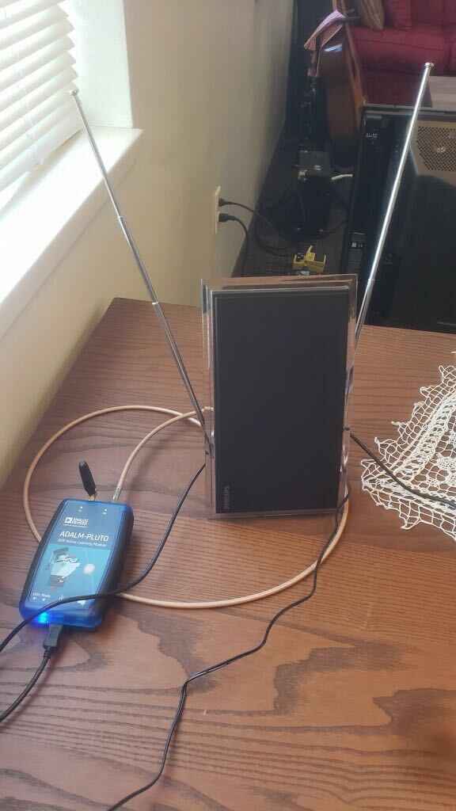
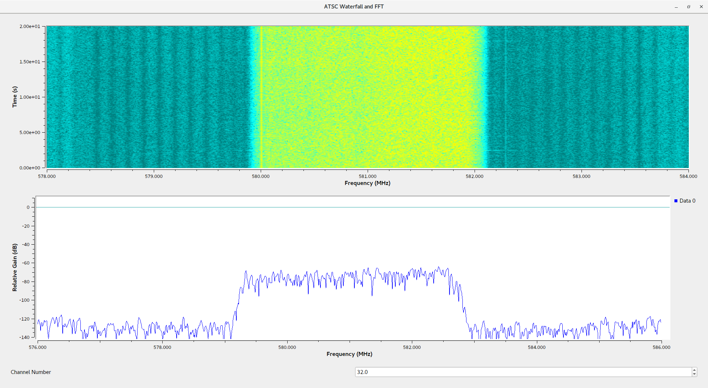

# ATSC Waterfall and FFT

This flow graph demonstrates using the PlutoSDR with GNU Radio to recieve ATSC television signals.

## Setup

1. Open [atsc-waterfall.grc](atsc-waterfall.grc) in GNU Radio Companion.

    <figure style="text-align: center;">
        
        <figcaption>
        Flowgraph open in GNU Radio
        </figcaption>
    </figure>

1. Connect the RX port of the PlutoSDR to an antenna meant for receiving TV signals with a coax cable.

    <figure style="text-align: center;">
        
        <figcaption>
        TV antenna connected to PlutoSDR
        </figcaption>
    </figure>

1. Run the flowgraph.

    <figure style="text-align: center;">
        
        <figcaption>
        Flowgraph running
        </figcaption>
    </figure>

## Configuration

The channel number can be changed by entering a number between 14 and 51 in the text box at the bottom of the window or by using the arrow buttons to the right of the text box.

Below is a list of ATSC channel numbers and their corresponding frequencies. ATSC channels are 6MHz wide, with the center of each channel being 6MHz away from the channels directly above and below it in the frequency spectrum. The ATSC pilot tone is a constant tone broadcast at 309.440559 KHz above the bottom of the channel. This tone is used by the reciever to lock on to the signal. The center frequency of a channel can be found by simply adding 3MHz to the lower edge listed in the table for a particular channel number.

| Channel Number| Lower edge (MHz) | ATSC pilot (MHz) | Upper edge (MHz) |
|:-: | :-: | :-: | :-: |
|14 | 470 | 470.31 | 476 |
|15 | 476 | 476.31 | 482 |
|16 | 482 | 482.31 | 488 |
|17 | 488 | 488.31 | 494 |
|18 | 494 | 494.31 | 500 |
|19 | 500 | 500.31 | 506 |
|20 | 506 | 506.31 | 512 |
|21 | 512 | 512.31 | 518 |
|22 | 518 | 518.31 | 524 |
|23 | 524 | 524.31 | 530 |
|24 | 530 | 530.31 | 536 |
|25 | 536 | 536.31 | 542 |
|26 | 542 | 542.31 | 548 |
|27 | 548 | 548.31 | 554 |
|28 | 554 | 554.31 | 560 |
|29 | 560 | 560.31 | 566 |
|30 | 566 | 566.31 | 572 |
|31 | 572 | 572.31 | 578 |
|32 | 578 | 578.31 | 584 |
|33 | 584 | 584.31 | 590 |
|34 | 590 | 590.31 | 596 |
|35 | 596 | 596.31 | 602 |
|36 | 602 | 602.31 | 608 |
|37 | 608 | 608.31 | 614 |
|38 | 614 | 614.31 | 620 |
|39 | 620 | 620.31 | 626 |
|40 | 626 | 626.31 | 632 |
|41 | 632 | 632.31 | 638 |
|42 | 638 | 638.31 | 644 |
|43 | 644 | 644.31 | 650 |
|44 | 650 | 650.31 | 656 |
|45 | 656 | 656.31 | 662 |
|46 | 662 | 662.31 | 668 |
|47 | 668 | 668.31 | 674 |
|48 | 674 | 674.31 | 680 |
|49 | 680 | 680.31 | 686 |
|50 | 686 | 686.31 | 692 |
|51 | 692 | 692.31 | 698 |
